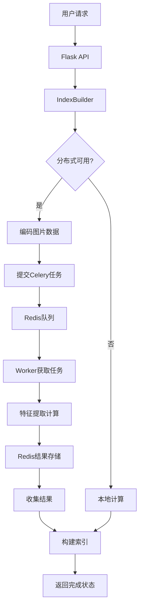

# Celery+Redis分布式任务分派实现说明

## 🏗️ 整体架构

```
Flask API → IndexBuilder → Celery Worker (Redis) → 特征提取任务
    ↓           ↓              ↓                    ↓
   接收请求   → 任务分发    → 队列处理          → 并行计算
```

## 📋 具体实现流程

### 1. **API层接收请求** (`build_index.py`)
```python
@build_index_bp.route('/build_index', methods=['POST'])
def build_index():
    # 设置分布式标志
    distributed = True  # 默认启用分布式
    
    # 创建IndexBuilder并传递分布式参数
    builder = IndexBuilder(dataset_dir, ds_name, distributed=distributed)
    builder.build(progress_file=progress_file)
```

**关键点**：
- Flask API接收构建索引的请求
- 设置`distributed=True`启用分布式计算
- 传递参数给IndexBuilder进行任务分发

### 2. **任务分发器** (`IndexBuilder`)
```python
# 在index_builder.py中
if self.distributed and self.distributed_available:
    # 使用分布式计算
    for fname in img_files_to_process:
        # 将图片编码为base64
        img_data_b64 = base64.b64encode(img_data).decode('utf-8')
        
        # 提交到Celery队列
        future = generate_embeddings_task.delay(img_data_b64)
        task_futures.append((idx, fname, future))
```

**关键点**：
- 检查分布式计算是否可用
- 将图片文件编码为base64字符串
- 使用`task.delay()`方法异步提交任务到Redis队列
- 收集任务Future对象用于后续结果获取

### 3. **Celery Worker处理** (`worker.py`)
```python
@celery_app.task(bind=True, max_retries=3)
def generate_embeddings_task(self, img_data_b64):
    # 解码图片数据
    img_bytes = base64.b64decode(img_data_b64)
    img = Image.open(BytesIO(img_bytes))
    
    # 特征提取计算
    embedder = feature_extractor()
    feat = embedder.calculate(img)
    
    return feat.tolist()  # 返回结果
```

**关键点**：
- 使用`@celery_app.task`装饰器定义异步任务
- 解码base64图片数据
- 执行CPU密集型的特征提取计算
- 返回计算结果供调用方获取

### 4. **结果收集和处理**
```python
# 处理所有远程任务结果
for idx, fname, future in task_futures:
    try:
        embedding_list = future.get(timeout=120)  # 获取结果
        embedding = np.array(embedding_list, dtype='float32')
        features.append(embedding.squeeze())
        processed_fnames.append(fname)
    except Exception as e:
        logger.error(f"处理图片 {fname} 的远程任务失败: {e}")
```

**关键点**：
- 使用`future.get()`阻塞等待任务完成
- 设置超时时间防止无限等待
- 处理异常情况，确保系统稳定性

## 🔧 Redis作为中间件的作用

### **消息队列**
- 存储待处理的特征提取任务
- 支持任务优先级和路由
- 提供持久化保证任务不丢失

### **结果存储**
- 保存计算完成的特征向量
- 支持结果过期时间设置
- 提供快速的键值对访问

### **状态管理**
- 跟踪任务执行状态（pending/running/success/failure）
- 支持任务重试机制
- 提供Worker健康状态监控

## 🔄 完整数据流向



## 🎯 关键优势

### **1. 异步处理**
- Flask主线程不会被特征提取任务阻塞
- 可同时处理多个构建请求
- 提升系统响应速度和吞吐量

### **2. 并行计算**
- 多个Worker进程可同时处理不同图片
- 充分利用多核CPU资源
- 显著减少总体处理时间

### **3. 容错机制**
```python
@celery_app.task(bind=True, max_retries=3)
def generate_embeddings_task(self, img_data_b64):
    try:
        # 任务执行逻辑
        pass
    except Exception as exc:
        if self.request.retries < self.max_retries:
            raise self.retry(countdown=60, exc=exc)
        else:
            raise exc
```
- 任务失败时自动重试
- 设置重试次数和延迟时间
- 记录详细的错误日志

### **4. 智能回退**
```python
if self.distributed and self.distributed_available:
    # 尝试分布式计算
    try:
        # 分布式处理逻辑
        pass
    except Exception as e:
        logger.error(f"分布式计算失败: {e}，回退到本地计算")
        self._process_images_locally(...)
else:
    # 直接使用本地计算
    self._process_images_locally(...)
```
- Redis不可用时自动切换到本地计算
- 保证系统在各种环境下都能正常工作
- 提供透明的降级服务

### **5. 进度追踪**
- 通过进度文件实时监控处理状态
- 支持前端轮询获取进度信息
- 提供用户友好的进度反馈

## 🚀 性能对比

| 处理方式 | 优势 | 劣势 | 适用场景 |
|---------|------|------|----------|
| **分布式模式** | 并行处理、不阻塞主线程、可扩展 | 需要Redis服务、配置复杂 | 生产环境、大量图片 |
| **本地模式** | 简单可靠、无依赖 | 串行处理、可能阻塞 | 开发环境、少量图片 |

## 🛠️ 启动和使用

### **1. 启动Redis服务**
```bash
redis-server
```

### **2. 启动Celery Worker**
```bash
cd backend
python -m celery -A worker worker --loglevel=info --pool=solo
```

### **3. 启动Flask应用**
```bash
python backend/app.py
```

### **4. 发送构建请求**
```json
POST /api/build_index
{
    "dataset_names": ["dataset1", "dataset2"],
    "distributed": true
}
```

## 📊 监控和调试

### **查看任务状态**
```python
# 获取活跃的Worker
i = celery_app.control.inspect()
active_workers = i.active()

# 查看任务统计
stats = i.stats()
```

### **Redis队列监控**
```bash
# 查看队列长度
redis-cli llen celery

# 查看所有键
redis-cli keys "*"
```

这种分布式任务分派架构为图像特征提取提供了**高效、可靠、可扩展**的解决方案，特别适合处理大规模图像数据集的场景。
