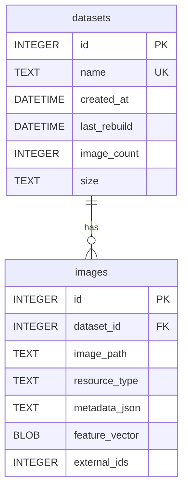

# 浮图-数据库设计文档

<center><div style='height:2mm;'></div><div style="font-family:华文楷体;font-size:16pt;"><b>Project Architecture Document 
  </div></div></center>


<center><div style='height:2mm;'></div><div style="font-family:华文楷体;font-size:16pt;"><b>版本 1.0
  </div></div></center>


<div style="page-break-after:always;"></div>

<!-- 注释语句：导出PDF时会在这里分页 -->

<center><strong><div style="font-family:华文楷体;font-size:16pt;">变更记录</strong></center>

| 日期      | 版本 | 变更说明                                       | 作者   |
| --------- | ---- | ---------------------------------------------- | ------ |
| 2025.5.21 | 1.0  | 进行迭代V1版本开发，初步书写架构文档           | 蔡怡乐 |
| 2025.5.24 | 1.1  | 增加数据视图和部署视图，根据完善前后端接口部分 | 郑达均 |

<!-- 注释语句：导出PDF时会在这里分页 -->

<div style="page-break-after:always;"></div>

## 

### 表结构定义

#### 数据集表 `datasets`
| 字段名       | 类型     | 描述               |
| ------------ | -------- | ------------------ |
| id           | INTEGER  | 主键，自增         |
| name         | TEXT     | 数据集名称（唯一） |
| created_at   | DATETIME | 创建时间           |
| last_rebuild | DATETIME | 上一次重建时间     |
| image_count  | INTEGER  | 包含的图片数量     |
| size         | TEXT     | 数据集总大小       |

```sql
CREATE TABLE datasets (
    id INTEGER PRIMARY KEY AUTOINCREMENT,
    name TEXT NOT NULL UNIQUE,
    created_at DATETIME NOT NULL,
    last_rebuild DATETIME,
    image_count INTEGER NOT NULL DEFAULT 0,
    size TEXT NOT NULL DEFAULT 0
);
```

---

#### 图片表 `images`
| 字段名         | 类型    | 描述                                      |
| -------------- | ------- | ----------------------------------------- |
| id             | INTEGER | 主键，自增                                |
| dataset_id     | INTEGER | 外键，关联 `datasets.id`                  |
| image_path     | TEXT    | 图片的文件路径或 URL                      |
| resource_type  | TEXT    | 控制端或计算端资源（`control`/`compute`） |
| metadata_json  | TEXT    | 附加信息的 JSON 字符串                    |
| feature_vector | BLOB    | 图片的特征向量（二进制存储）              |
| external_ids   | INTEGER | 非主键 ID（JSON 或逗号分隔）              |

```sql
CREATE TABLE images (
    id INTEGER PRIMARY KEY AUTOINCREMENT,
    dataset_id INTEGER NOT NULL,
    image_path TEXT NOT NULL,
    resource_type TEXT CHECK(resource_type IN ('control', 'compute')) NOT NULL,
    metadata_json TEXT,
    feature_vector BLOB,
    external_ids INTEGER,
    FOREIGN KEY (dataset_id) REFERENCES datasets(id) ON DELETE CASCADE
);
```

---

### 关联关系说明

- **逻辑关系**：  
  `datasets.id` 与 `images.dataset_id` 通过外键关联，表示“一个数据集包含多张图片”。
  - 通过外键约束确保数据一致性（如删除数据集时自动删除关联图片）。
  - 通过 `datasets` 表集中管理元信息（如图片数量、大小统计）。

### 4. ER 图（Mermaid 格式）



