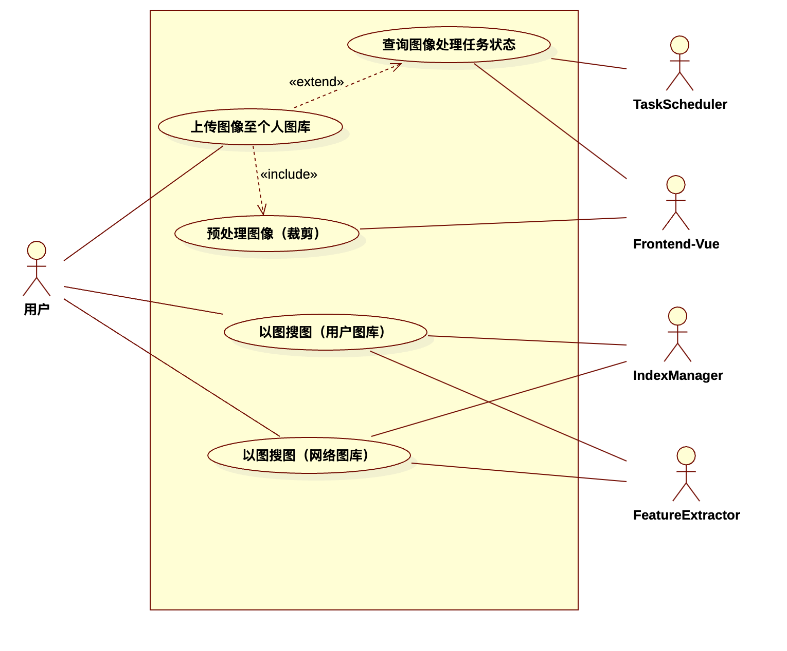
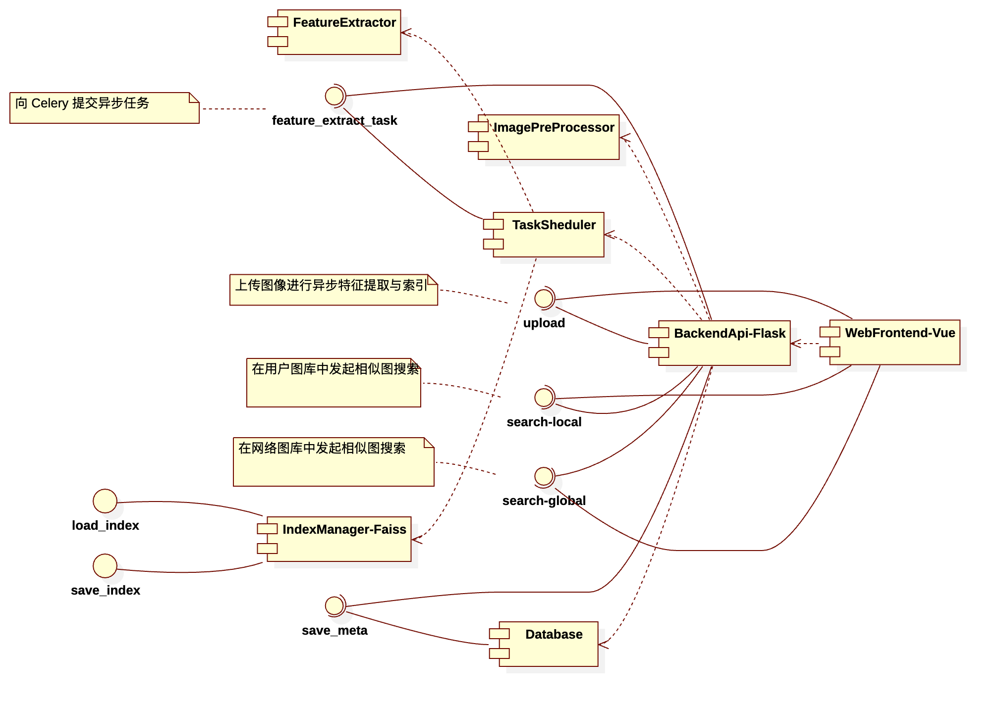
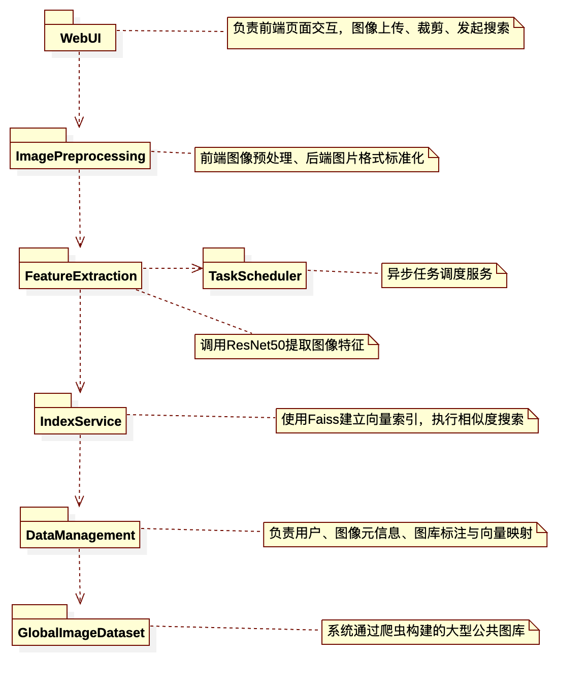
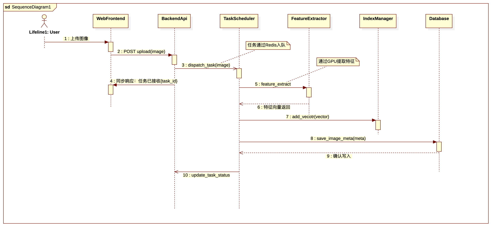
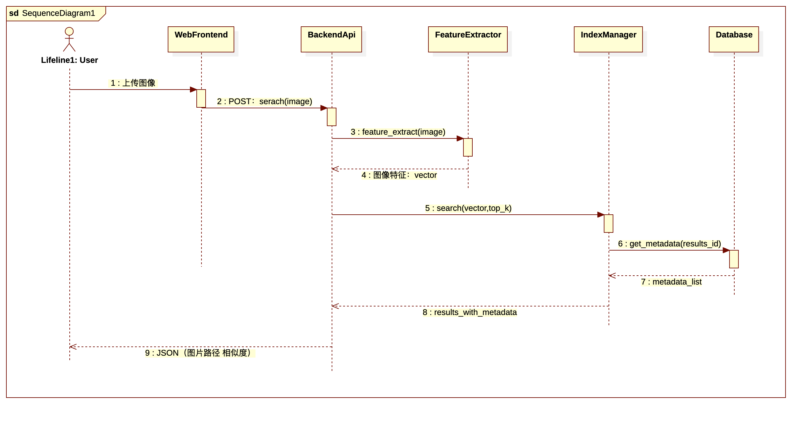

# 浮图-软件架构文档

<b>Project Architecture Document 
  

<b>版本 1.0
  

<!-- 注释语句：导出PDF时会在这里分页 -->

<strong>
变更记录</strong>

| 日期      | 版本 | 变更说明                             | 作者   |
| --------- | ---- | ------------------------------------ | ------ |
| 2025.5.21 | 1.0  | 进行迭代V1版本开发，初步书写架构文档 | 蔡怡乐 |

<!-- 注释语句：导出PDF时会在这里分页 -->

## 简介

### 目的

​	本文档旨在描述 “Futu-Project” 图像搜索平台的软件架构设计。该平台致力于为用户提供基于图像内容的相似图像检索服务，支持用户创建和管理个人图库，并基于该图库或平台已集成的图像数据源进行图像搜索。用户可对待检索图片进行预处理（如裁剪）后上传，系统再完成后续的相似图像检索工作。

该文档面向系统的开发人员与测试人员，目的是明确系统的架构设计决策，为开发、测试、维护和后续扩展提供依据和指导。

### 范围

- 本项目的系统范围包括：
  - 用户注册与登录模块
  - 用户图库管理（上传、删除、查看图片）
  - 图像预处理功能（如图像裁剪）
  - 图像特征提取模块（基于预训练 ResNet50 模型）
  - 向量索引与相似度检索模块（基于 Faiss 库）
  - 图像数据源管理模块，包括：
    - 用户本地图库索引
    - 系统通过爬虫获取的网络图片索引
  - 前后端通信接口（基于 Flask 和 Axios）
  - 后台异步任务调度模块（基于 Redis + Celery）
- 不包括内容：
  - 模型训练功能（系统使用预训练模型）
  - 图像标注、手动打标签等人工辅助功能
  - 移动端应用支持（目前为 Web 端平台）

### 定义、首字母缩写词和缩略语

| **缩写/术语** | **定义**                                                     |
| ------------- | ------------------------------------------------------------ |
| CBIR          | Content-Based Image Retrieval，基于图像内容的检索方法        |
| Faiss         | Facebook AI Similarity Search，高效的向量索引库              |
| ResNet50      | Residual Neural Network, 50 层卷积神经网络，用于图像特征提取 |
| Flask         | Python Web 微框架，用于构建后端服务                          |
| Vue           | 前端 JavaScript 框架                                         |
| Axios         | 基于 Promise 的 HTTP 客户端，用于前后端通信                  |
| Celery        | 异步任务队列，支持任务调度与分布式执行                       |
| Redis         | 高性能键值对数据库，常用于缓存和消息队列                     |
| API           | Application Programming Interface，应用程序接口              |
| 图像预处理    | 用户上传图片前在前端进行的操作，如裁剪、缩放等               |
| 网络图库      | 由系统爬虫程序抓取并组织的第三方图像网站图像数据集合         |

### 参考资料

1. Facebook AI Research. *Faiss: A library for efficient similarity search and clustering of dense vectors*. [[GitHub\]](https://github.com/facebookresearch/faiss)
2. Flask 官方文档：https://flask.palletsprojects.com/
3. Vue 官方文档：https://vuejs.org/
4. Celery 官方文档：https://docs.celeryq.dev/
5. Redis 官方文档：https://redis.io/
6. Python requests 和 BeautifulSoup 爬虫技术文档（用于网络图片抓取）

### 概述

本软件架构文档包含以下章节内容：

- 第 2 节将介绍系统的架构表示方式及所采用的视图模型
- 第 3 节将列出系统在开发过程中需要满足的重要目标与约束条件
- 第 4 节以典型用例说明系统的关键功能及其实现方式
- 第 5 节描述系统的逻辑架构，包括模块划分和类结构设计
- 第 6 节讨论系统的进程结构及进程间通信方式
- 第 7 节说明系统在物理节点上的部署结构
- 第 8 节定义系统的实施视图，展示各层次间的依赖与接口关系
- 第 9 节将呈现系统的数据存储结构
- 第 10 节评估系统在大小与性能方面的设计考量
- 第 11 节解释架构如何满足系统的质量需求（如可扩展性、安全性等）

## 架构表示方式

本系统采用**多视图架构描述方法**，借助 Rational Unified Process（RUP）提出的“4+1”视图模型，从不同角度描述系统架构设计。各个视图之间相互补充，共同反映出系统的完整架构形态。

本项目的架构表示主要包括以下几个视图：

- **用例视图（Use Case View）**：展示系统最核心的功能需求和典型用户交互行为，描述了系统应对用户请求的主要场景。
- **逻辑视图（Logical View）**：反映系统中关键模块、类、包等结构的设计，是开发人员实现功能的蓝图，使用类图、包图进行描述。
- **进程视图（Process View）**：描述系统的运行时行为，展现系统中各主要进程或线程、异步任务的交互方式和调度流程。
- **部署视图（Deployment View）**：描述系统的部署结构，包括后端服务的运行节点、数据库、异步任务分布等物理架构信息。
- **实施视图（Implementation View）**：描述项目的代码结构划分、文件组织形式及各个模块之间的构建关系，使用组件图（Component Diagram）进行说明。

此外，考虑到系统具有图像数据库管理与索引存储等特点，本项目也补充了一个**数据视图（Data View）**，用于描述图库图像、特征向量等数据的组织方式和持久化结构。

本文档后续各章将依次详细阐述上述视图，并提供 UML 图示支持相关架构设计内容的表达。

## 架构目标和约束

本章节描述在架构设计阶段必须重点考虑的主要目标和外部约束条件。这些目标和约束对模块划分、技术选型、通信机制、部署策略等方面均产生了显著影响。

### 架构目标

本系统的软件架构需满足以下关键目标：

- **模块解耦、便于扩展**

  系统前后端、特征提取模块、索引模块之间应保持良好解耦，支持后续功能扩展（如更换模型、引入用户反馈学习机制等）。

- **支持大规模图像索引检索**

  构建高性能图像特征索引结构，保证在万级以上图库中可快速完成相似度计算并返回结果。

- **多源图像库统一管理**

  支持同时检索用户上传图像库和系统爬取图像库的数据，允许用户切换检索源，架构需支持多源索引集成和隔离。

- **用户友好操作流程**

  支持用户在上传图像前进行预处理（如裁剪），前后端交互需简洁高效，接口统一且健壮。

- **异步处理与性能保障**

  大规模图像特征提取和索引构建应异步完成，不阻塞主服务，任务调度需合理高效。

- **部署灵活、可移植性好**

  系统应可部署于本地测试环境和云服务器，采用脚本化部署方式确保环境一致性。

### 架构约束

以下约束在架构设计中需予以充分考虑：

- **预训练模型不可修改**

  系统使用 ResNet50 预训练模型进行图像特征提取，模型参数保持固定，架构需围绕特征提取接口组织。

- **计算资源有限**

  特征提取任务需在远程服务器上异步执行，前端设备不具备 GPU 能力；使用 Celery + Redis 实现任务分发。

- **异构数据源格式不统一**

  爬取图片来源多样，需预处理标准化格式（分辨率、编码格式等）后统一入库。

- **网络安全与数据隔离要求**

  用户图库与公共图库逻辑上分离，不共享数据，需在索引结构和访问权限上做隔离控制。

- **前端需兼容主流浏览器**

  Vue 实现的用户界面应在 Chrome、Firefox 等现代浏览器上良好运行，前端上传裁剪组件需轻量、响应快。

## 用例视图

本系统主要面向“普通用户”，提供以图搜图相关的图像上传、图库管理、相似搜索等功能。以下用例描述从用户视角出发，概括了系统核心功能需求，并为后续架构模块的设计提供依据。

| **用例编号** | **用例名称**           | **说明**                                           |
| ------------ | ---------------------- | -------------------------------------------------- |
| UC1          | 上传图像至个人图库     | 用户选择本地图片并上传，系统保存图像文件与元数据   |
| UC2          | 图像预处理（前端裁剪） | 用户可在上传前对图片进行裁剪，提升检索准确性       |
| UC3          | 查看用户图库           | 展示用户已上传的所有图像及其基本信息               |
| UC4          | 用户图库中以图搜图     | 用户上传查询图像，从个人图库中查找相似图片         |
| UC5          | 网络图库中以图搜图     | 用户上传查询图像，从爬虫抓取的图像库中查找相似图片 |
| UC6          | 查询异步处理任务状态   | 用户可查看上传图像的处理进度与是否可用             |

### 用例实现

#### UC1：上传图像至个人图库

- **用户操作**：选择本地图像，点击“上传”按钮。
- **处理流程**：
  1. 前端通过 Axios 调用 /upload 接口，提交图像；
  2. 后端接收请求，将图像保存至本地；
  3. 将处理任务封装为 Celery 异步任务并提交至 Redis；
  4. Celery Worker 调用 GPU 执行特征提取，完成后写入索引；
  5. 后端更新任务状态。
- **相关模块**：
  - Frontend (Vue)
  - BackendAPI (Flask)
  - TaskScheduler (Celery)
  - FeatureExtractor (ResNet)
  - FaissIndexManager
  - Database

#### UC2：图像预处理（前端裁剪）

- **用户操作**：在图像上传前，裁剪图像边界区域。
- **处理流程**：
  1. 用户使用前端内嵌裁剪器（如 Cropper.js）进行编辑；
  2. 裁剪操作发生在浏览器端；
  3. 裁剪后的图像作为最终上传数据提交。
- **相关模块**：
  - CropperComponent.vue
  - ImageUploadComponent.vue
- **后端不直接参与。**

#### UC3：查看用户图库

- **用户操作**：打开“我的图库”页面，浏览自己上传过的图像。
- **处理流程**：
  1. 前端向后端发起 /images/list 请求；
  2. 后端查询数据库中该用户的图像元数据；
  3. 返回图像路径和相关信息；
  4. 前端渲染图库视图。
- **相关模块**：
  - BackendAPI.get_image_list()
  - Database.query_user_images()
  - Frontend (Vue)

#### UC4：在用户图库中以图搜图

- **用户操作**：上传一张查询图像，查找本地图库中相似图片。
- **处理流程**：
  1. 前端调用 /search/local 接口上传图像；
  2. 后端使用 ResNet 同步提取特征向量；
  3. 使用 Faiss 在用户私有索引中执行 top-K 搜索；
  4. 查询数据库获取图像元信息；
  5. 返回相似图像列表并显示在页面中。
- **相关模块**：
  - BackendAPI.search_local()
  - FeatureExtractor
  - FaissIndexManager.search_local()
  - Database.get_image_meta()
  - Frontend (Vue)

#### UC5：在网络图库中以图搜图

- **用户操作**：上传一张图像，查找在公共图库中的相似图。
- **处理流程**：
  1. 前端调用 /search/global 接口上传图像；
  2. 后端同步提取特征向量；
  3. 使用 Faiss 在系统抓取的全局图像索引中进行搜索；
  4. 返回图像路径和信息。
- **相关模块**：
  - BackendAPI.search_global()
  - FeatureExtractor
  - FaissIndexManager.search_global()
  - Database.get_global_image_meta()
  - Frontend (Vue)

#### UC6：查询图像处理任务状态

- **用户操作**：在上传图像后，用户可查询处理状态（是否完成特征提取和索引）。
- **处理流程**：
  1. 前端轮询或触发请求 /task/status?task_id=...；
  2. 后端查询 Celery 任务状态或数据库中的状态记录；
  3. 返回状态：处理中 / 已完成 / 失败。
- **相关模块**：
  - BackendAPI.get_task_status()
  - TaskScheduler (Celery)
  - Database.task_status_table
  - Frontend (Vue)

###  用例图

## 逻辑视图

### 概述

本系统采用分层架构设计，逻辑结构划分为五大子系统，各子系统分别负责前端交互、图像处理、特征提取、相似度检索和数据存储等职责。整体系统结构体现为“控制分发 + 模型服务 + 索引服务 + 数据存储 + 用户接口”的解耦架构。

主要子系统包括：

1. **用户交互子系统（Web UI）**
2. **图像预处理子系统**
3. **特征提取与异步任务子系统**
4. **相似图检索子系统（索引服务）**
5. **数据管理子系统（用户图库 & 网络图库）**

各子系统之间通过 API 接口调用或异步消息队列进行通信，系统核心类之间的关系可使用 UML 类图或组件图表示。

### 在架构方面具有重要意义的设计包

#### 用户交互子系统（Web UI）

- 作用：负责用户界面交互，包括图像上传、裁剪、图库查看与搜索入口。
- 技术：基于 Vue + Axios 实现。
- 逻辑交互：
  - 将裁剪后的图像通过 Axios 上传至后端；
  - 调用 /search/local 或 /search/global 接口发起检索。

包含的组件：

- ImageUploadComponent
- CropperComponent
- SearchResultView

#### 图像预处理子系统

- 作用：用户可在前端裁剪图像，后端在接收到图像后可进一步格式统一化处理。
- 职责类：
  - ImageProcessor：
    - def resize()
    - def to_tensor()
    - def validate_format()

#### 特征处理与异步任务子系统

- 作用：调用预训练的 ResNet50 提取图像特征向量，并通过 Celery 异步执行该过程，避免阻塞。
- 技术：PyTorch + Celery + Redis
- 核心类：
  - FeatureExtractor
    - 使用 ResNet 模型进行提取
  - ExtractAndIndexTask（Celery 任务）
    - 延迟执行提取任务并将结果传送至索引模块

#### 相似图检索子系统（索引服务）

- 作用：使用 Faiss 进行高维向量索引与相似度计算。
- 核心类：
  - FaissIndexer：
    - build_index(features, ids)
    - search(query, top_k)
    - save/load_index()
- 逻辑分区：
  - LocalIndex：用户私有图库索引
  - GlobalIndex：网络爬取图库索引

#### 数据管理子系统

- 作用：统一管理用户、图像元数据、图库来源、索引引用关系。
- 技术：SQLite
- 主要类：
  - User：用户账号、权限、操作历史
  - ImageMeta：图像路径、所属用户、标签、上传时间等
  - VectorEntry：图像特征向量及其 Faiss 引用

### 逻辑视图-组件图

### 逻辑视图-包图

## 进程视图

本章节描述系统运行时的进程结构，包括各进程的职责划分、进程间的通信模式、异步任务调度机制以及远程计算资源的组织方式。重点展示系统如何将图像上传、特征提取、索引构建和相似度查询等功能拆分至不同处理流程中，以保障响应性能和系统可扩展性。

### 进程划分

系统主要包括以下几类运行时进程：

| **进程名称**       | **所属节点** | **类型** | **描述**                               |
| ------------------ | ------------ | -------- | -------------------------------------- |
| Web 客户端进程     | 用户浏览器   | 轻量级   | 通过浏览器进行图像上传、裁剪与查询操作 |
| Flask 后端服务进程 | Web 服务器   | 重量级   | 接收用户请求，调度同步或异步处理逻辑   |
| Celery Worker 进程 | 腾讯云服务器 | 重量级   | 执行异步图像特征提取与索引构建任务     |
| Redis 消息中间件   | 云服务器     | 后台服务 | 存储任务队列和任务状态，实现服务解耦   |
| Faiss 索引管理进程 | 本地或云端   | 轻量级   | 提供向量索引查询服务（CPU）            |
| 数据库服务进程     | 本地或云端   | 后台服务 | 提供图像元信息与向量映射的读取/写入    |

### 异步任务处理流程（图像上传）

当用户上传一张图像后，系统执行如下异步处理流程：

1. 用户通过前端页面上传图片（可裁剪）
2. Flask 后端将上传任务封装为 Celery 任务，提交给 Redis 消息队列
3. 腾讯云服务器中的 Celery Worker 异步接收任务
4. 使用 GPU 加速的 PyTorch 模型（ResNet50）对图像提取特征向量
5. 提取完成后将特征向量添加至本地 Faiss 索引（使用 CPU 完成）
6. 向 SQLite 数据库写入图像元信息和向量映射关系
7. 更新任务状态为“完成”，供前端查询

> > 通信模式：后端与 Celery 间通过 Redis 异步消息传递；状态反馈通过 Celery Task ID 查询，不使用轮询，而是事件触发式更新（如用户请求时查询状态）。

### 同步检索处理流程（图像查询）

当用户发起“相似图片查询”操作时，系统执行如下同步流程：

1. 用户上传一张查询图像至 /search/local 或 /search/global 接口
2. Flask 后端同步使用 PyTorch 模型对图像进行特征提取（CPU 或小模型）
3. 后端将提取后的向量提交至对应的 Faiss 索引进行搜索（本地 CPU 查询）
4. 检索结果返回图片路径与相似度，格式化为 JSON 返回前端

### 进程通信结构总结

| **通信对**                 | **模式**     | **说明**                         |
| -------------------------- | ------------ | -------------------------------- |
| Flask ↔ Celery             | 异步消息队列 | 通过 Redis 队列调度图像处理任务  |
| Celery ↔ FeatureExtractor  | 函数调用     | 调用 GPU 加速模型提取特征        |
| Celery ↔ FaissIndexManager | 函数调用     | 将提取向量添加至索引中           |
| Backend ↔ Database         | 本地 API     | 查询图像元数据、更新索引映射关系 |
| Frontend ↔ Backend         | REST API     | 上传图片、发起搜索、查询结果     |

### 图像上传任务顺序图

### 图像查询任务顺序图

## 部署视图

## 实施视图

### 概述

“Futu-Project” 系统采用典型的多层实施架构，总体分为以下四个逻辑层：

1. **表示层（Presentation Layer）**：基于 Vue 框架实现，负责用户界面展示、图像上传、裁剪与结果呈现。
2. **控制层（Controller Layer）**：由 Flask 提供 RESTful API，负责接收前端请求、参数解析及调度后端服务模块。
3. **服务层（Service Layer）**：包括图像预处理、特征提取、相似度搜索等业务逻辑模块，并集成异步任务调度机制（Celery）。
4. **数据层（Data Layer）**：包括 SQLite 数据库、Faiss 向量索引文件与本地图像存储，负责数据持久化与索引管理。

层与层之间的通信规则如下：

- 表示层仅与控制层交互，使用 HTTP/REST 接口；
- 控制层调用服务层中的模块接口（同步或异步），并负责任务状态管理；
- 服务层通过数据访问接口访问底层数据库和索引；
- 所有层之间保持松耦合，使用接口、任务消息、数据模型分隔职责。

构建与依赖管理方式：

- Python 后端使用 Conda 管理依赖环境；
- Vue 前端使用 npm 管理构建与依赖；
- 项目结构中各层的目录已明确划分，符合模块化设计规范。

**此处可以辅以逻辑视图中的包图和组件图来理解。**`

### 层

#### 表示层（Presentation Layer）

- 实现方式：Vue + Axios
- 关键组件：
  - ImageUploadComponent.vue：图像上传与裁剪
  - SearchResultView.vue：图像结果展示
  - TaskStatus.vue：异步任务状态查看
- 对外通信：通过 Axios 向 /upload、/search/local 等后端接口发送请求

#### 控制层（Controller Layer）

- 实现方式：Flask RESTful API
- 路由入口：
  - /upload: 提交图像，调度异步任务
  - /search/local: 同步搜索用户图库
  - /search/global: 同步搜索爬取图库
  - /task/status: 查询任务状态
- 模块结构：位于 backend/routes/

#### 服务层（Service Layer）

- 模块组成：
  - FeatureExtractor：使用 PyTorch + GPU 实现的特征提取器
  - FaissIndexManager：索引构建与搜索服务
  - ImageProcessor：图像预处理（如格式校验、转换）
  - CeleryWorker：异步任务分发与执行逻辑
- 特点：该层解耦业务流程，支持同步和异步两种服务调用路径

#### 数据层（Data Layer）

- 数据存储类型：
  - SQLite 数据库：用户信息、图像元数据
  - Faiss 索引文件：本地和全局图库向量索引
  - 图像存储：上传图像按路径保存在本地磁盘
- 数据模型：
  - User、ImageMeta、VectorEntry 等 ORM 映射结构
- 模块位置：backend/databases/ 和本地文件系统

## 数据视图

## 大小和性能

本系统在架构设计中充分考虑了数据规模与运行性能，确保在典型图像数据负载下仍能实现高响应速度与良好的资源利用率。

### 数据规模估算

#### 网络图库数据规模（爬虫爬取）

- 每个指定网站对应 **150~200 个 tag**
- 每个 tag 下抓取约 **200~300 张图片**
- 整体规模预计为：
  - 图片总量 ≈ 150 × 250 × 若干网站 ≈ 数十万张图像
  - 图像平均大小 ≈ 100~300KB（JPEG）
  - 特征向量大小：2048维，float32格式 ≈ 8KB/张
  - 向量索引文件体积预估：1万张 ≈ 80MB，10万张 ≈ 800MB（支持可管理规模）

#### 用户本地图库

- 单用户图库容量上限为 1GB
- 假设图像均为压缩格式，平均 250KB，则约支持上传 4000 张图像**
- 对应特征向量 ≈ 32MB，可快速索引

### 性能目标和约束

| **操作类型**          | **性能目标**                                                 |
| --------------------- | ------------------------------------------------------------ |
| 图像上传并异步处理    | 处理时间应随图像数量线性增长；对于少量图像（1~10张）应在 10 秒内完成；大批量上传受 GPU 资源约束 |
| 图像检索（本地/网络） | 使用 Faiss 完成搜索，应在 **毫秒级** 完成（top-K 检索 < 500ms） |
| 用户响应延迟          | 前端页面响应时间 < 1 秒                                      |
| 特征提取过程          | 使用 GPU 加速，单张处理时间 < 1 秒                           |
| 系统初期并发策略      | 当前支持 **单用户操作**，目标为后期扩展至多用户并发上传与查询 |

### 架构支持手段

为满足上述性能指标，系统设计中采取了以下优化手段：

- 使用 **Faiss** 构建向量索引，支持高维向量的高效相似度搜索；
- 特征提取使用 **ResNet50 + GPU** 加速，部署于腾讯云服务器；
- 使用 **Celery + Redis** 实现异步任务处理，避免阻塞主服务；
- 检索任务使用 **CPU 执行索引搜索**，释放 GPU 资源专用于特征提取；
- 系统模块设计为松耦合，未来可通过 **横向扩展 Celery Worker** 实现多用户并发支持。

## 质量

本章旨在描述系统架构如何支持项目在非功能性方面的质量属性，包括**可扩展性、可维护性、可移植性、可靠性、性能稳定性、安全性**等。以下将逐项展开说明。

### 可扩展性（Scalability）

系统设计采用模块化结构，各模块职责清晰、依赖关系明确，确保以下扩展能力：

- **水平扩展 Celery Worker**：异步任务处理由 Celery 驱动，可根据用户数量或任务量增加 Worker 实例（如 GPU 节点）。
- **图像索引分区设计**：用户图库索引与网络图库索引分离，便于未来支持多源检索策略（如用户共享图库、按类别检索等）。
- **支持多用户并发**：当前为单用户原型，控制层与服务层已预留多用户并发扩展结构（如用户 ID 关联上下文、异步状态查询接口设计）。

### 可维护性（Maintainability）

- 系统遵循**分层结构**与**清晰的包划分**（frontend, backend/routes, service modules, databases 等），便于代码理解与重构。
- 所有后端模块具备**统一接口风格**（RESTful），API 规范一致，便于文档化与测试。
- 使用 Conda 和 npm 管理依赖，支持环境隔离与重现。
- 异步处理流程与主逻辑解耦，Celery 模块封装清晰，便于测试与监控。

### 可移植性（Portability）

- 后端采用 Flask + PyTorch + Faiss，全基于跨平台 Python 库开发；
- 使用 SQLite 作为轻量数据库，便于本地部署测试；
- 前端基于 Vue 构建，可部署于任意支持静态资源托管的 Web Server；
- 项目依赖支持通过 Conda environment.yml 与 npm package.json 快速构建跨平台开发环境；
- 项目可部署于 Linux（腾讯云服务器）与本地 macOS 环境（已验证兼容性）。

### 可靠性与稳定性（Reliability）

- 图像上传与异步处理过程采用 Celery 消息队列保障任务可靠入队与执行；
- 特征提取失败、索引写入失败等异常场景均设计有错误处理与状态回传机制；
- 系统支持任务状态查询接口，确保用户可感知异步进度与错误信息；
- 所有关键模块（特征提取、索引更新、数据库访问）已在测试环境中独立验证。

### 性能与响应性（Responsiveness）

- 同步查询请求（top-K 相似度搜索）性能稳定，在万级索引规模下响应时间维持在 **500ms 内**；
- 异步任务（特征提取 + 索引构建）平均耗时 < 10s，具备良好扩展弹性；
- 系统前后端交互快速，客户端页面交互延迟控制在 **1 秒内**。

### 安全性（Security）

- 用户图库逻辑隔离，索引与元数据仅对对应用户可见；
- API 接口支持预留用户身份认证结构（如 Token 验证）；
- 图片上传接口具备格式校验、大小限制等基本防护机制；
- 后续可结合 HTTPS、安全存储机制强化系统抗攻击能力