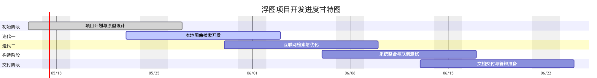

# 浮图-项目开发计划书

<b>Project Development Plan 
  

<b>版本 1.0
  

<!-- 注释语句：导出PDF时会在这里分页 -->

<strong>
变更记录</strong>

| 日期      | 版本 | 变更说明             | 作者   |
| --------- | ---- | -------------------- | ------ |
| 2025.5.16 | 1.0  | 项目启动，计划书起稿 | 蔡怡乐 |

<!-- 注释语句：导出PDF时会在这里分页 -->

## 项目总览

### 基本信息

<table border="1">
  <tr>
    <th>项目名称</th>
    <td>浮图</td>
  </tr>
  <tr>
    <th>项目编号</th>
    <td>FT-2025-V1</td>
  </tr>
  <tr>
    <th>项目经理</th>
    <td>蔡怡乐</td>
  </tr>
  <tr>
    <th>项目成员</th>
    <td>香安涛、郑达均、何家齐</td>
  </tr>
  <tr>
    <th>项目开始日期</th>
    <td>2025年5月16日</td>
  </tr>
  <tr>
    <th>项目结束日期</th>
    <td>2025年6月27日</td>
  </tr>
  <tr>
    <th>前端技术栈</th>
    <td>Vue + Axios</td>
  </tr>
  <tr>
    <th>后端技术栈</th>
    <td>Flask + Python + SQLite+Celery+Redis</td>
  </tr>
  <tr>
    <th>AI模块</th>
    <td>CNN 特征提取 + Faiss 向量检索</td>
  </tr>
  <tr>
    <th>项目部署方式</th>
    <td>本地部署，提供网页访问界面</td>
  </tr
</table>

### 项目概述

​	浮图是一个具有以图搜图功能的在线工具，用户上传图片后，系统会在图库或互联网中查找相似度最高的前k张图片并返回展示结果，支持用户下载对应图片。

​	项目设想包括两种主要用法：

1. **本地图库检索模式**：用户上传一张query图片和自定义图库，系统返回相似度前k高的图片；
2. **互联网搜索模式**：用户仅上传一张query图片，系统通过互联网爬虫结合图像向量检索，在互联网上寻找最相似的图片并返回。

​	本项目目标是在前后端分离架构下完成图片上传、特征提取、向量索引、相似度排序、图像展示、结果下载等完整流程的实现，并提供良好的用户交互体验

### 假设和约束

- 项目使用 Vue 作为前端框架，Axios 负责请求转发，后端为 Flask + Python；
- SQLite 为初期数据库，未来可根据需要扩展为 MySQL 或 PostgreSQL；
- 图像特征提取使用 CNN（ResNet）模型，向量搜索基于 Faiss；
- 互联网检索模式的图像爬虫接口可能受限于外部服务（需处理响应失败情况）；
- 项目开发时间为五周，团队成员需合理协调课程与项目任务；
- 本项目作为教学/课程项目，暂不考虑商业版权问题；
- 不考虑高并发、CDN部署等大规模线上系统特性。
- 预算资金为零

### 里程碑提交产品

| **阶段**  | **迭代目标与关键任务**                                       | **提交产品**                                                 | **时间范围**         | **负责人**                                                 |
| --------- | ------------------------------------------------------------ | ------------------------------------------------------------ | -------------------- | ---------------------------------------------------------- |
| 初始阶段  | 项目启动、确定愿景、完成项目计划与初步需求建模               | 项目开发计划书 、软件需求规约（初稿）、用例模型草图、 界面原型图 | 第1周（5.16 - 5.22） | 蔡怡乐（协调）香安涛（AI接口设想与测试）何家齐（界面原型） |
| 细化阶段1 | 第一轮迭代：实现**图像上传 + 本地图像检索功能**，搭建CNN模型原型，集成前后端数据流 | 架构设计文档、用例实现规约V1、迭代版本V1（局部功能）         | 第2周（5.23 - 5.29） | 郑达均（后端接口）香安涛（Faiss检索）何家齐（上传组件）    |
| 细化阶段2 | 第二轮迭代：扩展**互联网图像检索功能**，优化数据库管理与检索排序逻辑 | 架构设计文档更新、用例实现规约V2、迭代版本V2（拓展功能）     | 第3周（5.30 - 6.5）  | 郑达均（爬虫模块）郑达均（数据库优化）何家齐（展示页面）   |
| 构造阶段  | 第三轮迭代：完成所有功能模块整合，测试上传、搜索、预览与下载等完整流程 | 迭代版本V3（系统整合） 、系统功能演示视频初版                | 第4周（6.6 - 6.12）  | 全体成员（联调测试）                                       |
| 交付阶段  | 系统测试、缺陷修复、用户体验优化、文档归档与项目答辩准备     | 最终版本V4项目总结报告、 答辩PPT、系统代码包与说明文档       | 第5周（6.13 - 6.19） | 蔡怡乐（总结归档）全体成员（答辩展示）                     |

### 可行性分析

本项目在启动前进行了小组调研与初步技术验证，认为具有以下可行性：

- **技术可行性**  
  项目采用 Vue + Axios 作为前端框架，Flask + Python 作为后端服务，结合 PyTorch 和 Faiss 实现图像特征提取与相似度检索。所采用技术均为成熟开源组件，具有良好的开发文档与社区支持，适合教学与原型验证。

- **资源可行性**  
  图像检索任务所需的 CNN 模型采用预训练网络，团队成员拥有 RTX 4060 级别 GPU，可满足本地测试与开发需求；数据库采用轻量级 SQLite，部署与运维开销小。

- **团队可行性**  
  项目团队共 4 人，具备前端、后端、AI 模块等完整技能分布，成员之间沟通机制成熟，蔡怡乐可统一协调开发进度和任务分配。

- **展示可行性**  
  项目契合“软件开发综合实训”课程要求，完整覆盖需求、设计、实现、测试与交付环节，具备较强的展示性与实训价值。

------

## 项目计划

### 项目生命周期

本项目《浮图》采用**敏捷开发模型**，结合迭代思想和UML用例驱动方法进行分阶段交付开发。项目共设**5周周期**，包含以下四个主要阶段：

- **初始阶段**（Week 1）

  明确项目目标、愿景、架构蓝图，确定关键需求与风险；完成项目开发计划、用例建模与原型设计。

- **细化阶段**（Week 2 - Week 3）

  分两轮迭代：

  - 第一次迭代：开发图像上传 + 本地图像检索模块。
  - 第二次迭代：扩展互联网图像检索功能 + 结果展示优化。

- **构造阶段**（Week 4）

  聚焦于功能整合与后端数据交互的稳定性，进行系统联调与测试，准备最终交付版本。

- **交付阶段**（Week 5）

  完成系统重构与缺陷修复，撰写总结文档、部署配置说明，并进行项目答辩与展示。

每轮迭代均需制定迭代计划，明确负责人与交付物，确保功能逐步可用、系统逐步完善。

### WBS表

<table border="1">
  <tr>
    <th>编号</th>
    <th>任务名称</th>
    <th>任务描述</th>
    <th>工作量（天）</th>
    <th>负责人</th>
  </tr>
  <tr>
    <td>1.1</td>
    <td>制定开发计划</td>
    <td>撰写并提交项目计划文档</td>
    <td>1</td>
    <td>蔡怡乐</td>
  </tr>
  <tr>
    <td>1.2</td>
    <td>搭建开发环境</td>
    <td>Git、Python、Vue、SQLite等配置</td>
    <td>2</td>
    <td>郑达均</td>
  </tr>
  <tr>
    <td>2.1</td>
    <td>图像上传模块开发</td>
    <td>前端上传组件+后端接收接口</td>
    <td>3</td>
    <td>何家齐、郑达均</td>
  </tr>
  <tr>
    <td>2.2</td>
    <td>CNN 图像特征提取</td>
    <td>使用预训练模型提取图像向量</td>
    <td>3</td>
    <td>香安涛</td>
  </tr>
  <tr>
    <td>2.3</td>
    <td>Faiss 检索模块开发</td>
    <td>向量索引与 TOP-K 相似图返回</td>
    <td>3</td>
    <td>香安涛</td>
  </tr>
  <tr>
    <td>2.4</td>
    <td>结果展示模块</td>
    <td>检索结果在网页端展示</td>
    <td>2</td>
    <td>何家齐</td>
  </tr>
  <tr>
    <td>3.1</td>
    <td>互联网图像检索扩展</td>
    <td>爬虫接口与特征提取自动化</td>
    <td>3</td>
    <td>香安涛</td>
  </tr>
  <tr>
    <td>3.2</td>
    <td>数据库优化</td>
    <td>管理图像数据、特征与元数据</td>
    <td>2</td>
    <td>郑达均</td>
  </tr>
  <tr>
    <td>4.1</td>
    <td>系统测试与集成</td>
    <td>功能联调、缺陷修复</td>
    <td>3</td>
    <td>全体</td>
  </tr>
  <tr>
    <td>5.1</td>
    <td>文档总结与答辩准备</td>
    <td>撰写报告、录制运行视频、制作PPT</td>
    <td>3</td>
    <td>蔡怡乐</td>
  </tr>
</table>

### 工作量估算

| **阶段**       | **工作量（人日）** | **比例（%）** |
| -------------- | ------------------ | ------------- |
| 需求分析       | 3                  | 12%           |
| 设计           | 4                  | 16%           |
| 编码           | 11                 | 44%           |
| 测试           | 5                  | 20%           |
| 项目总结和交付 | 2                  | 8%            |
| **总计**       | **25**             | **100%**      |

### 进度安排

### 开发环境

| **类别**         | **环境配置说明**                                             |
| ---------------- | ------------------------------------------------------------ |
| **硬件**         | 开发设备包括 Windows 和 macOS 平台，部分成员配备 NVIDIA RTX 4060 GPU，支持 AI 模型训练与加速计算。 |
| **操作系统**     | Windows 11、macOS 14（Sonoma）                               |
| **前端开发工具** | Visual Studio Code、WebStorm（基于 Vue 框架开发，使用 Axios 通信） |
| **后端开发工具** | PyCharm、VSCode（使用 Flask 框架）                           |
| **AI 环境**      | 使用 Anaconda 创建虚拟环境，配置 PyTorch、Faiss 库，加载预训练 CNN 模型（如 ResNet） |
| **数据库工具**   | SQLite 3，使用命令行和 DB Browser for SQLite 进行测试与可视化管理 |
| **版本控制工具** | Git + GitHub 私有仓库，团队协同开发与代码管理                |
| **文档工具**     | Typora（Markdown 编辑）+ Word（正式文档输出），UML 图使用 StarUML 与 Mermaid |
| **测试工具**     | Postman（接口测试），浏览器 DevTools，Python 单元测试框架    |

说明：

- 所有成员通过 GitHub 协作提交代码和文档，采用分支管理与 Pull Request 审核机制；
- 使用 Anaconda 管理 Python 包依赖，有助于一致性环境部署；
- AI 模块采用 PyTorch 框架，并结合 Faiss 向量库实现图像相似度检索；
- UML 建模使用 StarUML 绘图，需求阶段采用 Mermaid 快速可视化。

### 风险评估与控制

在项目开发过程中，可能存在以下风险点，项目组已提前制定相应的控制策略：

| 风险编号 | 风险点描述                       | 风险等级 | 应对措施                                                 | 责任人          |
| -------- | -------------------------------- | -------- | -------------------------------------------------------- | --------------- |
| R1       | CNN 模型识别效果不佳，检索失准   | 中       | 使用多个预训练模型（如 ResNet50、EfficientNet）对比调试  | 香安涛          |
| R2       | Faiss 在部分平台兼容性问题       | 中       | 在 macOS 与 Windows 下提前测试 Faiss 安装与运行情况      | 郑达均          |
| R3       | 前后端接口不一致，尤其是路由格式 | 高       | 提前制定接口文档（REST规范），接口改动后及时同步通知前端 | 何家齐 + 郑达均 |
| R4       | 何家齐为线上协作，沟通受限       | 中       | 制定定期线上会议，确保接口、页面同步清晰                 | 蔡怡乐          |
| R5       | Git 冲突或版本丢失问题           | 低       | 使用 Git 分支管理规范（feature/dev/main），定期合并审核  | 蔡怡乐          |
| R6       | 网络限制导致互联网图像爬虫失败   | 中       | 增加图像数据集本地缓存备份，爬虫任务增加容错逻辑         | 郑达均          |

### 组间协作计划

| **协调小组/人**          | **协调方式**                  | **协调内容**                                                 | **问题处理方式**                                             | **协调频率与时间**            |
| ------------------------ | ----------------------------- | ------------------------------------------------------------ | ------------------------------------------------------------ | ----------------------------- |
| 蔡怡乐 ↔ 香安涛 ↔ 郑达均 | 线下会议、微信、电话          | 项目规划与管理、 CNN 模型与后端接口设计、 数据库结构与数据流对接 | 现场即时沟通 + 建立问题清单，必要时迭代计划内进行调整        | 每周线下会议 1 次，必要时加急 |
| 何家齐 ↔ 蔡怡乐          | 微信、Typora 文档、腾讯会议   | 前端进度反馈、页面布局原型审查、项目展示风格统一             | 微信视频 + Typora 注释反馈，必要时录屏说明界面细节           | 每周线上对接 1~2 次           |
| 何家齐 ↔ 郑达均          | 接口文档、Issue 留言、微信    | 前后端路由设计、API 请求路径规范、返回数据格式与字段命名对齐 | 接口文档统一由郑达均维护，问题通过 GitHub Issue 留存，定期同步修改意见 | 按模块交付节奏灵活沟通        |
| 全体成员                 | 微信群、腾讯会议、GitHub 协同 | 迭代功能验收计划、版本发布节点、系统测试与联调               | 项目经理统一收集汇总问题，线上例会对齐目标与任务分配         | 每周一次，线上或线下          |

- **线下协调为主**：蔡怡乐、香安涛、郑达均可直接面对面快速决策；
- **线上支持灵活沟通**：何家齐虽线上协作，但安排定期对接，确保数据流和 UI 接口无误；
- **工具支持**：统一使用 GitHub 进行代码合并，PR 审核机制与 Issue 跟踪问题；
- **项目经理主控协调节奏**：由蔡怡乐设置阶段目标，召开迭代同步会；
- **跨人问题统一归档**：用 Typora 或 Markdown 文档记录联调说明、接口规范。

------

## 项目组成

| **角色名称**       | **责任承担人** | **角色职责简述**                                             |
| ------------------ | -------------- | ------------------------------------------------------------ |
| 项目经理           | 蔡怡乐         | 负责整体项目进度把控、计划制定、评审组织、文档整合及答辩汇总 |
| 开发经理           | 香安涛         | 负责 AI 模块的模型调用、特征提取、Faiss 检索逻辑开发与优化   |
| 后端负责人         | 郑达均         | 负责后端 Flask 框架搭建、数据库建模与操作、接口编写与调试    |
| 前端负责人         | 何家齐         | 负责 Vue 页面开发、用户交互设计、上传与展示模块、接口联调    |
| 测试工程师（兼任） | 全体成员       | 在每轮迭代中协作进行单元测试、功能测试与反馈                 |
| 文档负责人（兼任） | 蔡怡乐         | 统筹项目文档输出（需求规约、计划书、总结报告、答辩PPT 等）   |
| SCM 管理员（Git）  | 郑达均         | 负责 Git 仓库管理，分支、合并、Tag发布，协助他人解决冲突问题 |
| 架构审阅者（协助） | 香安涛、蔡怡乐 | 参与架构设计、提出技术优化建议                               |

说明：

- 项目成员职责上采用**垂直分工 + 交叉审阅机制**；
- 每位成员除主责角色外，也需参与联调、测试与答辩准备；
- SCM（配置管理）实际通过 GitHub 私有仓库管理，由郑达均负责技术支持；
- 测试职责不单独设岗，由全体成员轮流进行分工与回归验证。

------

## 问题跟踪

### 问题跟踪方式

- 项目过程中如遇到以下情况，应立即记录进《项目问题跟踪表》：
  - 关键功能无法如期实现（如 CNN 模型异常）
  - 成员时间投入不足或变动
  - 技术环境异常（如 Faiss 不兼容某平台）
  - Git 合并冲突频发
  - 接口对接出现格式混乱等问题
- 项目经理蔡怡乐需：
  - 指定一位负责人对每个问题进行跟踪处理
  - 在每周例会中汇报问题状态（已解决/处理中/搁置）

------

## 相关文档

| **文档名称**             | **编写负责人** | **提交阶段**  |
| ------------------------ | -------------- | ------------- |
| 项目开发计划书           | 蔡怡乐         | 第1周初始阶段 |
| 软件需求规格说明书       | 蔡怡乐         | 第1周末       |
| 用例规约文档             | 香安涛         | 第1~2周       |
| 软件架构文档             | 香安涛、郑达均 | 第2周         |
| 用例实现规约             | 香安涛         | 第2~3周       |
| 数据库设计说明书         | 郑达均         | 第3周         |
| 个人周报（每人每周提交） | 全体成员       | 每周          |
| 项目总结报告             | 蔡怡乐         | 第5周         |
| 答辩演示PPT              | 全体成员       | 第5周         |
| 系统运行视频与部署文档   | 蔡怡乐         | 第5周         |

说明：

- 所有文档统一命名，上传至 GitHub 项目 docs/ 文件夹；
- 项目总结报告需汇总各阶段评审意见、版本迭代内容、问题记录与解决措施。