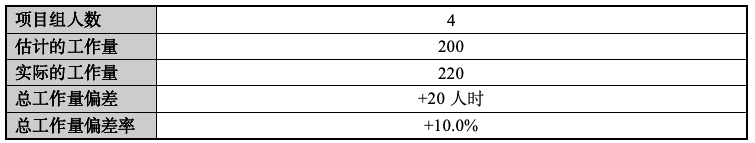

# 浮图-项目总结报告

<b>Project Summary Report
  

<b>版本 1.0
  

<!-- 注释语句：导出PDF时会在这里分页 -->

<strong>
变更记录</strong>

| 日期      | 版本 | 变更说明                         | 作者   |
| --------- | ---- | -------------------------------- | ------ |
| 2025.6.24 | 1.0  | 版本V4迭代完毕，书写项目总结报告 | 蔡怡乐 |

<!-- 注释语句：导出PDF时会在这里分页 -->

## 项目信息

## 项目说明

本平台为一个支持以图搜图功能的在线图像检索工具，用户可通过上传图像，在个人图库或系统构建的网络图库中查找最相似的图像结果。平台集成图像预处理（如裁剪）、特征提取（基于预训练 CNN 模型）、向量索引构建（基于 Faiss 库）与相似度排序等关键模块，能够实现图像相似性搜索与图库查重等功能。系统采用前后端分离架构，前端基于 Vue 构建，后端使用 Flask 框架，整体结构清晰，交互流畅，具备良好的可扩展性与展示性。

## 项目周期

### 项目进度总结

### 偏差原因说明

项目启动阶段出现一定延迟，主要受以下几方面因素影响：

- **课业负担冲突**：项目初期恰逢多门课程作业集中提交，部分成员在时间分配上受到限制，未能立即投入项目开发；
- **远程协作限制**：前端负责人需线上远程协作，初期未能与后端团队及时对齐需求和开发节奏，导致部分接口开发和测试进度滞后；
- **任务优先级不明确**：初期任务划分与关键路径识别不够清晰，导致部分非关键任务耗费时间，影响主线进度推进；
- **开发环境搭建成本**：团队在搭建 Faiss、PyTorch 等深度学习与检索组件时，初期花费了较多时间进行兼容性调试。

虽然存在上述因素，团队及时识别问题并调整策略，有效控制了偏差范围，确保了后续开发进度的稳定推进。

### 改进措施

针对初期偏差，项目组采取了以下多项改进措施，有效提升整体开发效率与协作质量：

- **强化线下对接与日程同步**：核心成员定期组织线下会议，集中梳理当前问题、明确每阶段目标，确保进度同步；
- **明确关键任务优先级**：由项目经理梳理任务依赖关系，优先推进接口联调、模型集成等核心模块，确保项目主线不断；
- **优化前后端协作机制**：由后端负责人维护统一的 REST API 文档，配合 GitHub Issue 留存变更说明，提升前端接入效率；
- **规范 Git 分支管理流程**：建立 feature/dev/main 分支策略，所有代码提交均需 Pull Request 审核，降低合并冲突与版本错误；
- **技术文档与接口文档同步完善**：每轮迭代后及时补充 Typora 编写的联调说明与接口变更记录，确保远程成员清晰掌握当前状态；
- **灵活调整开发节奏**：对于部分可并行任务，适当打破原有顺序安排，交叉进行，提高整体资源利用率。

通过以上措施，项目进度逐步恢复正常节奏，并在中后期阶段保持稳定推进，最终在预定时间内高质量完成全部功能模块开发与测试工作。

## 开发环境和工具

### 开发工具

- **代码开发工具**：
  - Visual Studio Code：主要用于 Vue 前端开发；
  - WebStorm：辅助进行前端组件设计与联调；
  - PyCharm：用于 Flask 后端接口与业务逻辑开发；
- **版本控制工具**：
  - Git + GitHub：采用私有仓库管理代码版本，按功能需求分支进行协作开发；
- **UML 建模工具**：
  - StartUML：用于绘制用例图、类图等结构图；
  - Mermaid：用于快速生成流程图、顺序图等轻量可视化内容；
- **接口测试与调试工具**：
  - Postman：用于后端接口调试与联调测试；
  - 浏览器 DevTools：用于前端功能测试和性能分析；
- **文档编辑工具**：
  - Typora：编写需求规约、协作说明、接口文档；
  - Microsoft Word：用于正式文档的输出整理。

### 开发环境

- **数据库**：SQLite 3，作为轻量级关系型数据库，用于存储图像元数据与索引映射。
- **应用服务器**：Flask，基于 Python 的轻量 Web 框架，负责前后端数据交互与任务调度接口。
- **AI 模块运行环境**：
  - Python + PyTorch，集成预训练的 CNN 模型（ResNet）；
  - Faiss 向量库，用于图像特征索引与相似度检索；
  - Anaconda 管理虚拟环境与依赖配置；
- **客户端浏览器**：平台支持现代浏览器访问，兼容 Chrome、Firefox 等主流浏览器，确保前端裁剪组件的交互性能与兼容性。
- **运行平台与设备**：
  - 开发与测试设备包括 macOS 和 Windows 系统；
  - 后端模型与任务调度模块部署于具备 NVIDIA RTX 4060 显卡的 Windows 主机，以支持 GPU 加速处理。

## 估计偏差率

### 进度估计偏差率（%）

### 工作量估计偏差率（%）

## 工作量

### 工作量概况

#### 项目工作量情况

| 阶段   | 计划工作量（人时） | 实际工作量（人时） | 是否已完成 | 偏差（人时） | 相对偏差率（%） |
| ------ | ------------------ | ------------------ | ---------- | ------------ | --------------- |
| 第一周 | 15                 | 15                 | 是         | 0            | 0.0%            |
| 第二周 | 35                 | 40                 | 是         | +5           | +14.3%          |
| 第三周 | 45                 | 50                 | 是         | +5           | +11.1%          |
| 第四周 | 45                 | 50                 | 是         | +5           | +11.1%          |
| 第五周 | 40                 | 45                 | 是         | +5           | 12.5%           |
| 第六周 | 20                 | 20                 | 是         | 0            | 0.0%            |

#### 偏差原因说明

项目整体工作量偏差较小，但在第 2～5 周的主力开发阶段，实际工时超出初步估算，具体偏差原因如下：

- **AI模块调试复杂度较高**：图像特征提取与 Faiss 向量检索模块虽基于已有开源组件，但在跨平台兼容性、向量维度校准与精度控制方面仍需反复验证，导致任务耗时高于预期。
- **图像查重功能开发工作量增加**：为实现查重功能中的“相似度计算 + 分组去重 + 最小索引保留”策略，项目组需开发专门的 Faiss 查询逻辑、特征批处理与相似度转百分比算法，这部分原未在立项工作量中细化，最终实际工时增加约 10 人时。
- **前后端联调次数较多**：由于项目采用前后端分离架构，API 规范在编码期阶段不断演化，实际联调过程中多次修正字段名、数据结构与路由格式，增加了测试与调试负担。
- **远程协作初期效率偏低**：前端负责人采用线上开发模式，在需求反馈与接口对接的实时性上不如线下成员，初期存在沟通不充分、任务推进节奏不同步的问题。
- **测试阶段自定义用例较多**：平台核心功能涉及查重、相似度排序、异步任务处理等多个模块交叉，单元测试难以覆盖全部边界条件，因此团队手动构造了大量测试用例，提升了测试质量的同时也带来了工作量增长

#### 改进措施

针对上述偏差因素，项目组在中后期开发过程中有针对性地采取了以下改进措施，有效控制了整体工时偏差：

- **任务重估与优先级调整**：项目经理在每周阶段评审中，根据开发实际进度动态调整各成员工作重心，如将图像查重功能提前至第 3 周实现，以便留出充足时间用于测试与优化。
- **强化线下集中讨论与角色对接**：为解决远程协作瓶颈，核心成员安排定期线下会议，每次会前集中梳理接口状态与代码结构，现场对齐开发目标与字段定义，大幅降低了误解与返工。
- **文档与接口规范持续维护**：由后端负责人郑达均负责统一更新 API 文档，通过 Typora 编写并共享 REST 路由、请求结构与参数说明，确保前后端均可快速接入；
- **任务模块化与并行推进**：项目经理将工作细化为前端组件开发、后端接口联调、AI功能测试、数据库结构设计等独立子任务，分别分配不同成员并行执行，有效缓解瓶颈问题；
- **Git 流程标准化与代码审查机制**：团队使用 Git 分支管理（feature / dev / main），所有成员通过 Pull Request 进行代码提交，项目经理定期审查合并请求，提升代码质量与交付效率；
- **测试用例复用与结构化回归**：测试阶段将手动测试用例结构化归档，分模块执行回归测试，并通过日志记录问题与修复状态，避免重复劳动，提高测试阶段的性价比。

### 工作量分布情况

#### 工作量按阶段、按活动分布的情况

#### 偏差原因说明

项目各阶段的实际工作量分布与初步计划整体相符，偏差集中出现在编码与测试阶段，主要原因包括：

- **功能实现难度被低估**：图像查重模块虽然在设计时结构清晰，但实际实现中涉及对 Faiss 向量库底层操作的封装、相似图像分组策略设计以及冗余图像选择逻辑，工作量远超预期，推动了编码阶段整体人时增长；
- **数据库结构扩展导致设计与编码阶段重叠**：第 3 周后期，团队临时决定增强数据库的数据一致性与图像数据集抽象结构，这一变更涉及数据库 schema 更新、数据持久化方式调整，部分工作穿插在编码阶段中执行，导致设计与编码边界模糊；
- **联调与回归测试成本提升**：由于系统包含多个异步任务路径（如上传异步建索、查重过程特征批提取等），不同模块间状态依赖较多，在测试阶段需要进行多轮次组合验证，单轮测试往往触发多个后端路径，整体测试复杂度上升；
- **前端展现逻辑迭代频繁**：为提升用户体验，项目在开发后期根据评审反馈对查重结果展现方式进行多轮优化（如高亮展示、结果分组、手动删除交互等），虽然提升了交互性，但也导致前端编码和测试量同步增加。

尽管偏差幅度不大，但在关键阶段工作量超出预期的情况下，项目组及时调整了节奏与资源，确保每个阶段任务均能如期完成。

#### 改进措施

针对工作量分布偏差，项目组采取了以下改进与管理策略，有效缓解中后期人时压力：

- **明确工作阶段划分与交叉策略**：项目经理根据实际情况将部分后置任务（如爬虫图库查重与数据库优化）适当前移，并行执行，以提升整体资源使用效率，避免阶段工作量集中过高；
- **加强模块间接口契约与测试边界定义**：编码阶段明确前后端、AI模块与数据库之间的输入输出边界与测试目标，减少联调过程中的反复试错；
- **快速反馈的 UI 调整机制**：对于查重结果展示与用户操作逻辑优化，项目采用快速迭代方式，由前端负责人与测试成员同步评审，明确可执行范围，减少不必要的视觉层改动；
- **测试任务结构化与自动化支持**：在测试阶段将重复测试任务抽象为测试流程模板，通过统一输入图像、固定检索路径与比对预期结果，提高了人工测试的执行效率；
- **集中安排压力较高阶段的人力投放**：第 3~5 周为开发与测试密集期，项目经理主动协调成员时间安排，保障主力开发成员能投入足够人时于核心模块，确保进度不落后。

通过上述举措，项目团队实现了阶段工作负荷的均衡分布，避免了某一阶段因任务积压而出现重大瓶颈，为项目最终按期交付奠定了坚实基础。

## 生产率

#### 项目生产率情况

| 项目总工作量（人时） | **编码/单元测试阶段工作量（人时）** | **代码总规模（K 行）** | **项目生命周期生产率（代码功能点/人日）** | **编码/单元测试阶段生产率** | **计划编码/单元测试阶段生产率** | **编码/单元测试生产率偏差率** |
| -------------------- | ----------------------------------- | ---------------------- | ----------------------------------------- | --------------------------- | ------------------------------- | ----------------------------- |
| 20                   | 99                                  | 5.2                    | 0.24                                      | 0.53                        | 0.50                            | +6.0%                         |

#### 偏差原因说明

编码/测试阶段生产率略高于预估值，原因包括以下几点：

- **系统采用模块化设计，复用度较高**：查重、索引构建、搜索功能共享底层 Faiss 封装逻辑，减少重复编码工作量；
- **前期设计扎实、接口稳定**：在编码前阶段即已完成清晰的 API 规划与数据库结构设计，使后续代码实现具有良好指向性；
- **团队成员分工明确，协同高效**：AI 模块、后端接口、前端组件等分层开发任务清晰分离，避免重复投入与代码冲突；
- **测试阶段结构化执行，减少返工**：通过标准化测试流程与日志分析工具，缩短测试迭代周期，提高测试有效性。

#### 改进措施

尽管整体生产率高于计划，但为进一步提升效率、降低后期维护成本，项目组仍总结出以下优化建议：

- **进一步强化文档驱动开发（Doc-Driven Dev）**：建议后续项目中从初期即建立详尽的接口文档与数据交互规范，减少开发期交互试错成本；
- **推进自动化测试引入**：本项目测试仍以手工为主，若能引入自动化测试脚本与断言机制（如 Pytest、Vue Test Utils），可在后期测试阶段显著提升效率；
- **沉淀可复用组件库**：部分查重与索引管理功能具有通用性，建议整理为可复用组件库，用于后续图像相关项目中加速开发；
- **优化异步任务日志系统**：当前任务状态监控与错误日志仍依赖数据库状态与后端日志，后续可引入统一日志系统或任务仪表盘，以便于异常追踪与性能分析。

### 评审测试活动总结

#### 评审活动总结

| **阶段** | **是否评审** | **评审方式**           | **评审内容**                                 | **评审结果与结论**                                     |
| -------- | ------------ | ---------------------- | -------------------------------------------- | ------------------------------------------------------ |
| 需求阶段 | 是           | 小组会议 + Typora 记录 | 功能需求完整性、用户使用流程、用例合理性     | 明确图像检索与查重作为核心功能，确认不引入模型训练模块 |
| 设计阶段 | 是           | 图示审查 + 成员审阅    | 系统逻辑架构图、部署结构、模块间通信接口定义 | 调整异步任务调度方式，确保状态同步与日志记录可靠       |
| 编码阶段 | 是           | 代码走查 + Git PR审核  | 模块实现方式、接口一致性、数据库操作逻辑     | 优化部分模块封装，提升可读性与重用性                   |

#### 测试活动总结

| **测试类型** | **说明与范围**                                               |
| ------------ | ------------------------------------------------------------ |
| 功能测试     | 覆盖上传、图像裁剪、检索、查重、删除、任务状态轮询等所有主功能接口，验证响应逻辑和UI交互是否一致。 |
| 边界测试     | 针对非法格式图片、大文件上传、查重图库不足、重复图像比对误判等情况进行异常路径验证。 |
| 性能测试     | 测试 Faiss 检索响应时间，模拟多图上传场景，检查异步任务调度与处理是否及时。 |
| 可用性测试   | 邀请非组员使用系统，反馈用户交互、界面提示、图片展示等易用性问题，并进行小范围优化。 |

### 缺陷分布情况

| **阶段** | **缺陷数量（个）** | **缺陷占比** | **主要问题类型**                                   | **处理方式说明**                                |
| -------- | ------------------ | ------------ | -------------------------------------------------- | ----------------------------------------------- |
| 需求评审 | 3                  | 10%          | 功能描述不明确、用户流程边界未考虑                 | 明确“查重阈值配置范围”“查重与搜索差异”等描述    |
| 设计阶段 | 5                  | 17%          | 数据库结构冗余、任务状态更新逻辑不清               | 优化索引与图像分表关系，增加状态标识字段        |
| 编码阶段 | 12                 | 41%          | Faiss 调用错误、图像处理异常、前后端接口字段不一致 | 编码走查 + 补充测试，增加错误提示与日志记录机制 |
| 测试阶段 | 9                  | 31%          | 边界 bug、查重结果异常展示、前端组件兼容性问题     | 增加前端容错逻辑、后端查重误差容忍、样式微调    |

#### 缺陷特征说明

- 缺陷主要集中于编码与测试阶段，占总量 72%，符合 Web 应用开发中的典型规律；
- 边界 bug 多涉及输入非法、任务状态异常、数据源不一致等问题；
- 评审有效性较高，多项问题在正式开发前就已预警并规避，实现了前置质量控制。

## 项目问题

### 项目问题情况

项目在开发过程中主要遇到以下技术与管理层面的问题，尽管部分问题在中期对开发节奏产生影响，但均已在项目后期通过有效手段得到解决：

- **技术类问题**：
  - 开发平台间存在兼容性差异，部分依赖库（如 Faiss、PyTorch、OpenCV）在 macOS 与 Windows 系统中存在编译和路径依赖问题；
  - 预训练 CNN 模型响应速度受限于加载机制与数据批处理方式，影响高并发查重任务响应效率；
  - 图像索引存储方式初期仅支持内存存储，限制了图像库规模扩展；
  - 图像上传支持的格式有限，部分用户上传图片（如 WebP、HEIC）无法解析；
  - 检索结果前端展现存在适配问题，如加载过慢、图像比例异常、错位等 UI 表现不一致；
  - 异步任务处理缺少状态反馈机制，部分用户操作缺乏明确响应提示。
- **管理类问题**：
  - 项目前期由于成员课业负担与远程协作限制，任务推进节奏不均衡；
  - 初期任务粒度划分不细，模块边界模糊，责任归属不清晰；
  - 接口在开发过程中存在频繁调整，导致前后端联调反复；
  - Git 协作中存在部分代码冲突，需手动回滚与协调；
  - 缺乏统一测试记录与缺陷管理机制，问题重复出现几率较高。

### 偏差原因说明

上述问题虽未导致项目延期，但对编码工作量与测试周期造成一定偏移，产生了以下偏差因素：

- **估算不充分**：查重模块、索引管理、图片适配处理等任务在初期未被充分识别为复杂模块，实际开发工时显著增加；
- **接口设计调整频繁**：由于缺乏前期 API 稳定版本，后续字段结构多次调整，对前端开发与联调带来额外开销；
- **协作效率初期不高**：线上协作的成员难以同步参与关键决策，导致 UI 实现与后端接口之间存在时滞；
- **调试资源消耗大**：由于涉及深度学习模型调用、图片处理与向量检索，调试与测试过程中需耗费大量时间核查数据一致性与结果准确性；
- **模块之间耦合度超出预期**：如图像上传后即触发索引任务，UI、后端与数据库耦合点较多，单一模块更改易影响整体流程。

### 调整措施

针对上述问题与偏差，项目组在中期及后期开发过程中采取了以下调整措施并取得良好效果：

- **技术层面**：
  - 统一开发环境与依赖管理方案，采用 Anaconda 虚拟环境配置依赖，分平台测试验证；
  - 将 Faiss 索引持久化到磁盘，按需加载提升内存管理效率；
  - 增加图片格式兼容性支持模块，并统一图像上传后的处理流程；
  - 优化模型批处理逻辑，采用缓存机制减少重复计算，提高响应速度；
  - 对前端结果展示逻辑进行重构，增强响应式布局与加载容错能力；
  - 引入任务状态反馈机制，提升用户操作透明度与系统可控性。
- **管理层面**：
  - 项目经理强化每周进度同步机制，组织线下例会及时对齐目标与风险；
  - 任务分解更具颗粒度，细化模块职责，明确每个成员的交付边界；
  - 制定并持续维护统一的 API 文档规范，避免前后端重复沟通；
  - Git 分支管理制度化，采用 Pull Request 审核流程降低冲突频率；
  - 测试用例结构化管理，定期更新问题记录表与修复状态，增强测试追踪效率。

通过这些技术与管理手段的联合优化，团队有效克服中期风险，实现了高质量、按期交付的项目目标。

## 组建协调活动跟踪结果

| **协调小组/人**          | **协调方式**                 | **协调内容**                                               | **发生问题**                                 | **处理方式**                                                 | **时间**  |
| ------------------------ | ---------------------------- | ---------------------------------------------------------- | -------------------------------------------- | ------------------------------------------------------------ | --------- |
| 蔡怡乐 ↔ 香安涛 ↔ 郑达均 | 线下会议、微信、电话         | 项目计划制定、CNN 模型对接、数据库结构确认与后端接口设计   | 前后端模块开发节奏不一致，接口实现优先级冲突 | 第三周会议统一规划接口交付顺序，明确接口责任人，建立问题清单现场处理 | 第3周周中 |
| 蔡怡乐 ↔ 何家齐          | 微信、Typora 注释、腾讯会议  | 页面原型评审、前端模块开发进度反馈、展示逻辑与设计风格对齐 | UI 样式沟通效率较低，页面展示缺乏统一风格    | 第四周采用注释图 + 视频录屏方式明确交互需求，前端按统一风格手册进行修正 | 第4周周末 |
| 郑达均 ↔ 何家齐          | 接口文档、GitHub Issue、微信 | 前后端路由路径、接口格式、字段定义与联调测试               | 接口字段频繁变更，前端反复调试返工较多       | 第三周开始由郑达均统一维护接口文档，所有更改须发 Issue 通知前端 | 第3周周末 |
| 全体成员                 | GitHub、微信群、腾讯会议     | 版本发布、功能验收、Bug 提交与修复、测试反馈               | 第三轮迭代中功能进度不同步，联调节奏受到影响 | 第五周项目经理更新开发计划，任务分块调整并提前测试验证模块，提高整体联调效率 | 第5周周初 |

## 提交产品清单

| 里程碑    | 提交产品       | 完成时间  | 负责人                         |
| --------- | -------------- | --------- | ------------------------------ |
| 需求/计划 | 软件开发计划   | 2025.5.16 | 蔡怡乐                         |
|           | 软件测试计划   | 2025.5.20 | 蔡怡乐                         |
|           | 配置管理计划   | 2025.6.3  | 郑达均                         |
|           | 用例规约       | 2025.6.1  | 香安涛                         |
| 设计      | Solution Model | 2025.6.10 | 郑达均、香安涛                 |
|           | 数据库设计     | 2025.6.4  | 郑达均                         |
|           | 测试用例       | 2025.6.15 | 蔡怡乐、郑达均                 |
| 开发      | 代码           | 2025.6.25 | 香安涛、郑达均、何家齐、蔡怡乐 |
| 测试      | 测试报告       | 2025.6.25 | 蔡怡乐                         |
| 结项      | 项目总结       | 2025.6.26 | 蔡怡乐                         |

## 项目总结

​	本项目自 2025 年 5 月 23 日启动后，历时 38 天，于 2025 年 6 月 30 日正式结项。其间通过项目组成员不懈的努力，克服了项目周期紧张、AI模块依赖复杂、业务场景不熟悉、需求边界动态调整、远程协作受限等多方面困难，最终按期、高质量地完成了系统设计与功能开发工作，取得了圆满的成功。

​	回顾项目所跨越的五个开发周，项目团队始终坚持阶段性目标驱动，严格按照项目启动阶段所承诺的进度开展各项工作。项目采用敏捷迭代模式，先后完成图像上传、本地图像检索、网络爬虫扩展、查重展示、系统测试等多个核心功能模块的开发与集成。在功能完整性、运行稳定性与用户交互体验方面均达到了既定标准，整体开发质量达到预期。

​	在实施过程中，团队成员分工明确、配合默契，建立了稳定的沟通机制与协同流程。通过周期性线下会议、Typora 文档注释、GitHub Issue 管理与 API 接口标准化，项目有效解决了因角色分布与任务切换带来的协作难题。技术上，团队采用前后端分离架构，集成 Vue、Flask、PyTorch、Faiss 等技术栈，结合 SQLite 数据存储机制，实现了结构清晰、响应快速、可拓展性强的系统架构。

​	从项目文档体系建设、功能模块开发，到后期的测试联调与部署演示，项目各阶段工作推进均较为顺利。组内成员积极主动、责任心强，除完成本职模块任务外，也能跨模块支持测试验证、接口优化与视觉统一等多项工作，展现出良好的团队合作能力与专业素养。

​	本项目不仅如期实现了系统开发目标，也极大锻炼了团队在真实开发环境下的任务规划、风险应对、资源协调与文档交付能力。项目成果完整，系统运行稳定，功能达成全面，展现出项目团队良好的综合执行力与开发能力。